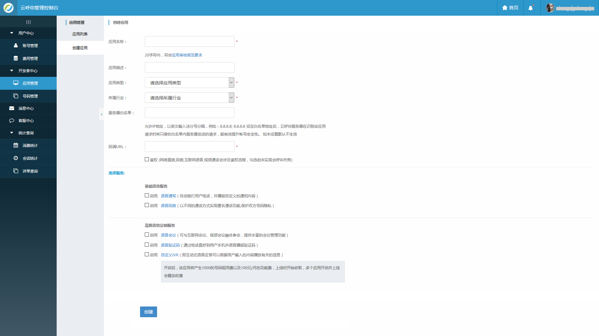

1首页
=====

注册成功后，即可进入开发管理后台，后台首页展示账户的基本信息，余额，通话质量，应用概况等等信息。

2用户中心
=========

2.1账户管理
-----------

### 2.1.1实名认证

完成实名认证是应用上线使用的前提，开发者可根据自身情况选择个人认证或者公司认证，未完成实名认证的应用只能在测试环境进行功能的开发调试，个人认证完成后开发者还可以升级到公司认证，认证一经审核完成，不可随意修改。

2.2费用管理
-----------

### 2.2.1费用管理

可查询开发者的消费记录、充值记录、充值订单和月结账单等信息。

### 2.2.2发票信息

开发者在索取发票前请浏览发票申请说明。

开发者进行发票申请前，需要先填写发票信息和邮寄信息。开发者可选择个人增值税普通票和企业增值税普通票，不同的发票类型需要相对应的认证资质。

## 2.3发票申请

填写完发票信息即可进行发票申请。

3开发者中心
===========

3.1应用管理
-----------

### 3.1.1应用列表

该页面可查看应用的概况，点击详情可查看应用的具体信息。

### 3.1.1.1应用详情

应用详情除了展示应用的详细信息以外还有放音媒体库（用于IVR服务等需要播放录音的服务）。

### 3.1.2创建应用

接入云呼你产品必须先创建应用，选择所需要接入的服务，完成初步的合作意向。

1、应用名称

应用名称长度不超过20个字符，必填项，方便区分管理不同的应用，保证该名称在当前账号下是唯一的。

2、应用回调地址

开发者自己搭建的应用服务器地址（域名或IP）。如：http://app.cloopen.com:8880。

平台运营人员在上线前会对此URL进行审核，该URL原则上应该是可正常访问的地址或服务。而云呼你平台用此URL来实现鉴权。勾选相应选项后云呼你平台可以用应用回调地址来进行相关业务控制。勾选鉴权后，可以实现用户权限验证、账户余额检查等。

3、服务器白名单

白名单中的服务器地址需填写域名或者IP地址，以英文输入法分号分隔，例如：8.8.8.8; 8.8.8.8 。设定白名单地址后，云呼你服务器在识别该应用请求时将只接收白名单内服务器发送的请求，能有效提升帐号安全性。 如未设置默认不生效。

4、应用类型

您可以根据所开发的应用类型进行选择。

5、备注：

自定义IVR：选择IVR应用后，该应用将产生100元/月的月租用费以及1000元的IVR号码租用费，上线时开始收取，多个IVR应用上线该费用会叠加。

3.2号码管理
-----------

### 3.2.1呼入号码管理

呼入号码作为应用使用IVR功能的拨入号码使用，作为应用正常上线运营后使用。

### 3.2.2测试号码绑定

测试号码用于应用上线前外呼，会议或其他业务调试使用。

==========================

4消息中心
=========

在会员使用控制台进行信息的变更等操作时，平台会及时反馈会员结果，以及平台有新的消息也会在此展示。

5客服中心
=========

针对整个平台的使用体验，会员可以在客服中心畅所欲言，我们将全力收集用户反馈意见，

尽力为会员排忧解难。

6统计查询
=========

6.1消费统计
-----------

此处展示会员的消费统计信息,有日统计与月统计可供查询。

6.2会话统计
-----------

会话统计显示会员应用的会话数等统计信息。

6.3详单查询
-----------

详单查询记录会员应用的每日功能使用详单。

