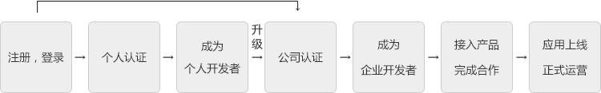

**账号认证审核说明**
账号认证主要为个人或者企业接入平台服务申请合作提供必要的信息，认证分为个人认证和公司认证，实名认证审核通过后，即可申请应用上线，正式运营。
**认证流程说明 **

**认证申请说明
**1.个人认证需要提交申请人真实姓名，证件类型（身份证或者护照），证件号码以及一张手持真实有效的中华人民共和国二代身份证的真人照片。

2.公司认证需要提交公司名称，办公地址，所属行业，申请人以及提供有效的公司营运证件信息，可选择的证件类型包括三证合一（一证一码），三证合一，三证分离。

