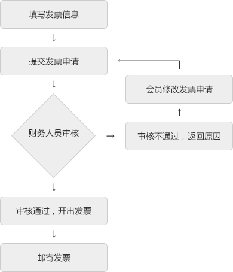

# 发票审核说明

1. 可开具的发票类型分为：个人增值税普通发票（消费额满100元起可申请开具），企业增值税普通发票（消费额满100元起可申请开具）和企业增值税专用发票（消费额满1000元起可申请开具），不同类型的发票需要对应的认证资质才能申请。

2.  官方活动赠送金额不计算在开票金额内。

3.  如果是由于开发者填写的开票信息、邮寄信息有误而引发的后果，将由开发者自行承担。

4.  可开具发票的金额为已结算的消费金额，会员的消费情况将在每个月的月底结算一次。

5.  每月25号之前提交的发票申请当月受理，25日之后申请则延期至下月受理。

## 发票审核流程
------------

