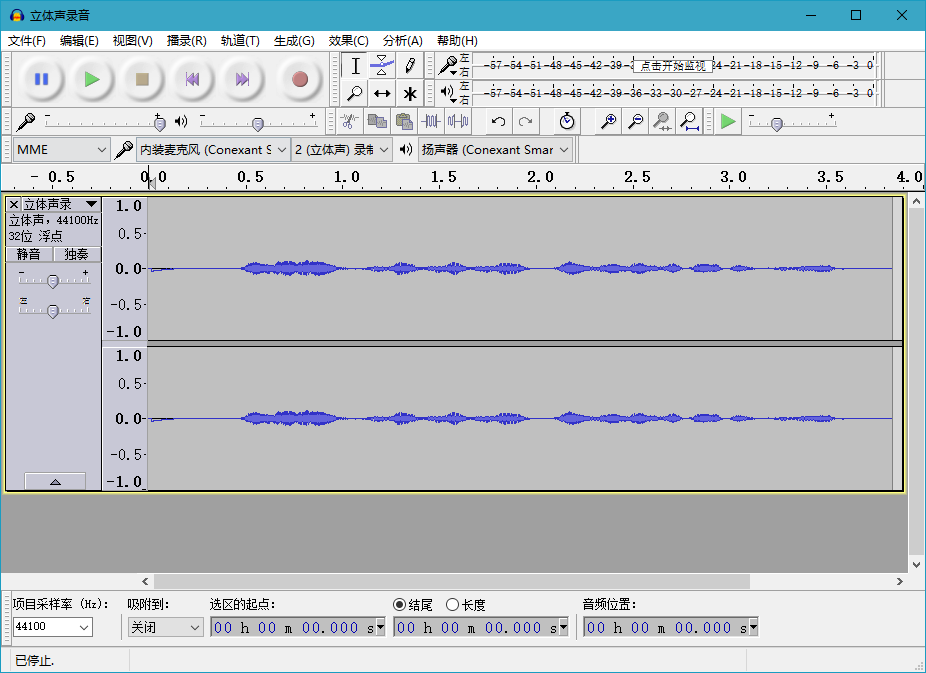
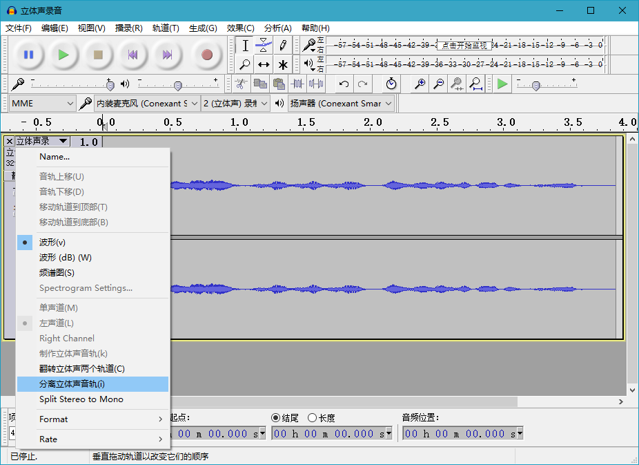
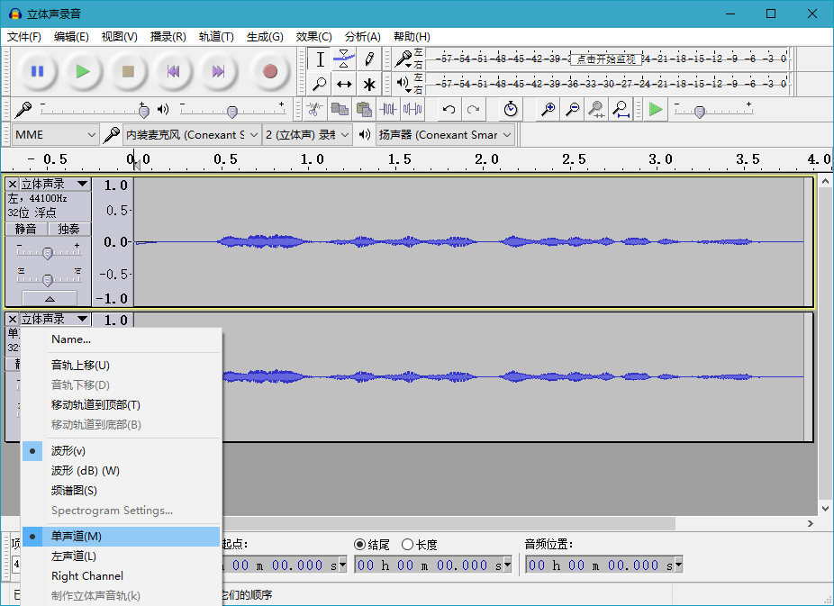
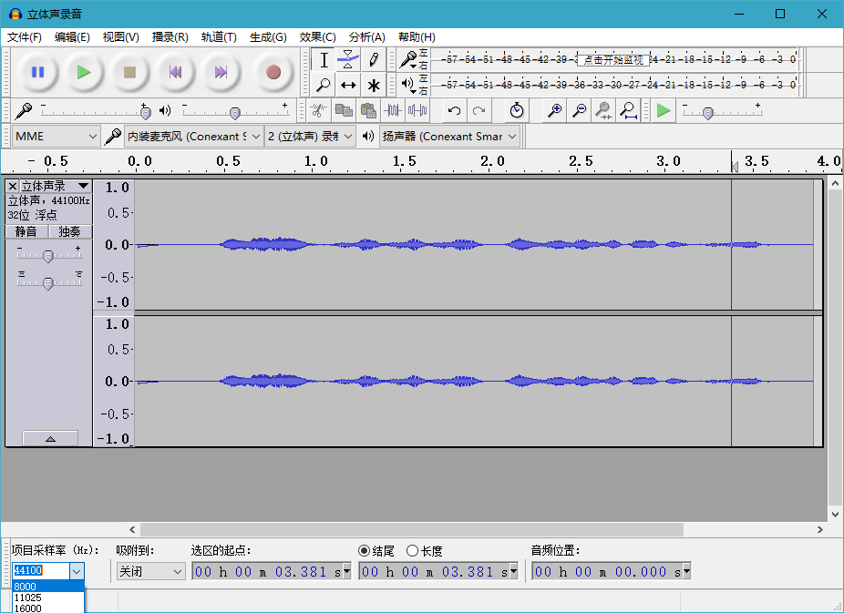
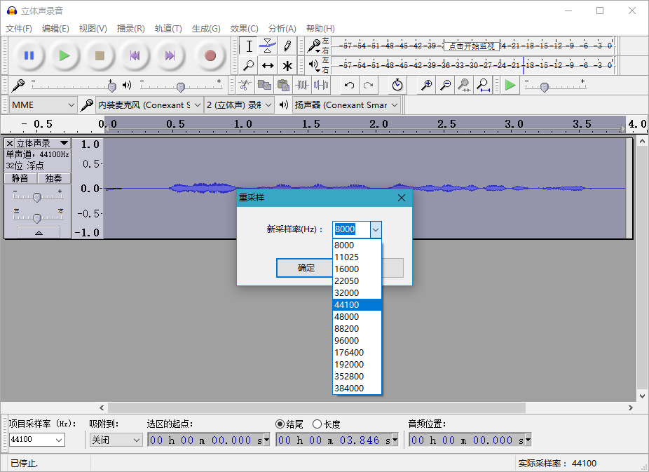

# 录音文件格式转换

## 1格式要求

[壹耘] 平台的使用的录音文件格式是：

- G.711.0 µ-law 或者 A-law编码
- 采样率8k/s
- 单声道
- 字长8位
- 文件应保存为.wav格式(带RIFF文件头)

## 2格式转换

推荐使用免费开源音频编辑工具软件 [audacity] 进行格式转换。

### 2.1 打开录音文件

通常的录音文件，是双声道，32位，采样率44K，使用 [audacity] 打开后如图：

### 2.2 转成单声道

选择轨道面板文件名下拉菜单中的“分离立体声音轨”。如果您的录音文件是单声道，可以忽略这一步骤。

选择左右声道中合乎要求的一个，在其轨道面板文件名下拉菜单中选择“单声道”，不要 选择“左声道”或者“右声道”。

然后再选中另外一个不用的音轨，点击其轨道面板的“X”将其关闭。

修改 [audacity] 窗口左下方的“项目采样率”选项，改成 “8000” Hz

最后，选中剩下的一个轨道，在主菜单点击“轨道”->“重采样”，修改其采样率为“8000”

### 2.3 导出

点击主菜单的“文件”->“导出选择的音频...”。

在弹出的保存文件对话框的“保存类型”中选择“其它非压缩音频文件...”；

“Format Options”选择“文件头”为“WAV (Microsoft)”，编码为“A-Law”。

